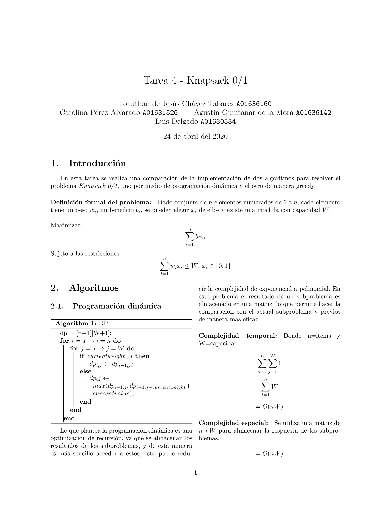
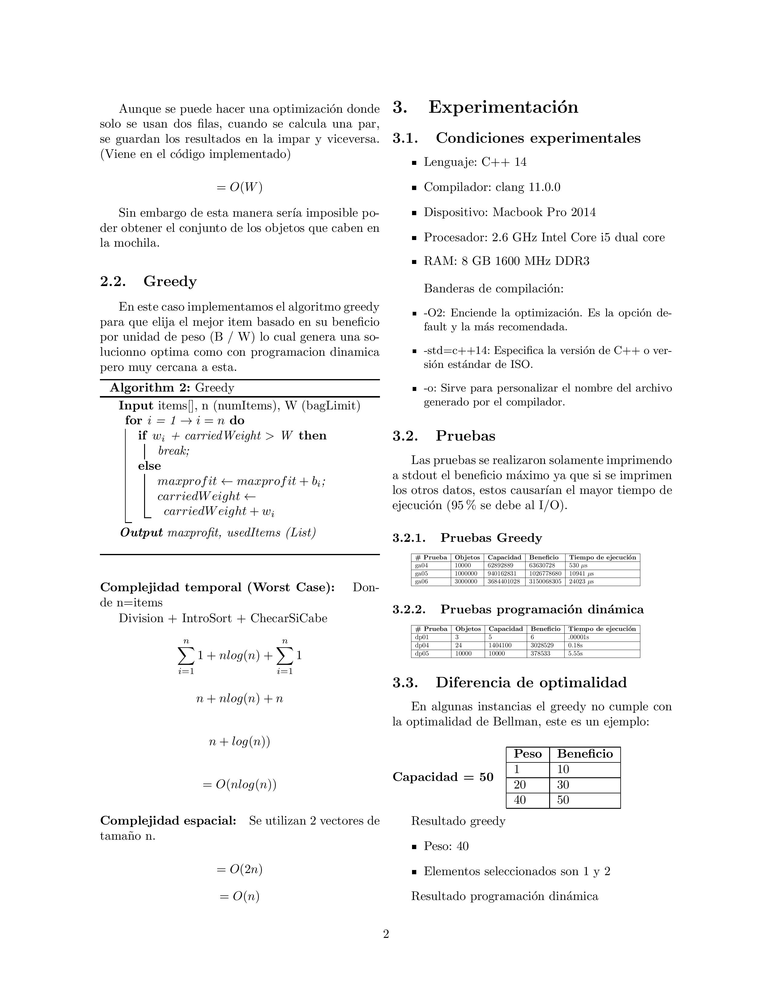
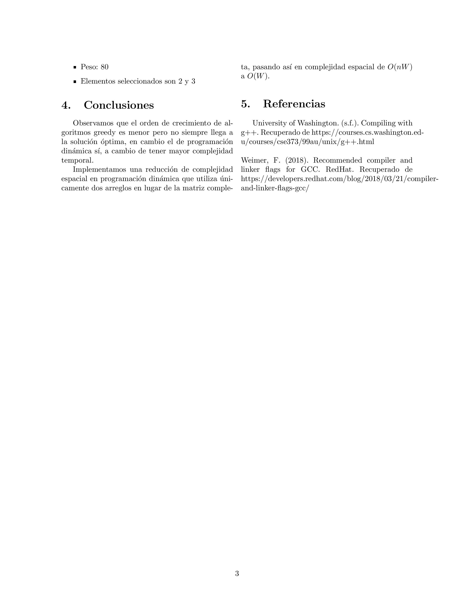

# Tarea Knapsack 0-1

## Autores

- Jonathan de Jesús Chávez Tabares
- Carolina Pérez Alvarado
- Agustín Salvador Quintanar de la Mora
- Luis Delgado

## Organización de archivos

Existen cuatro carpetas:

- **DP**

- **Greedy**

- **TestCasesGenerator**

- **Report**

Las primeras dos contienen lo siguiente:

- `main.cpp`: Código fuente del problema.
- `resultados.txt`: Archivo de texto con la respuesta a la instancia del problema.
- `tests`: Carpeta que contiene los tests de prueba en formato _.txt_.
- `ejecutable.out`: Archivo ejecutable (no existe al inicio).

La tercera contiene un script para generar test cases.

Y la cuarta contiene un reporte de los 2 algoritmos en Latex (el cual se encuentra en la parte de hasta abajo de este README).

## Instrucciones de ejecución

Las instrucciones sirven para Linux/Mac, asegúrese de tener gcc instalado.

1. Compile el código `main.cpp` usando el siguiente comando: `g++ main.cpp -std=c++14 -O2 -o ejecutable.out`.

Si se quiere imprimir las matrices, incluya: `-D MATRIX`.

Si se quiere imprimir los elementos seleccionados incluya: `-D ELEMENTS`.

Si se quiere correr la version optimizada de greedy incluya: `-D OPTIMIZE`.

2. Una vez compilado, se generará el archivo `ejecutable.out`, este puede ejecutarse y recibir entrada por standard input. Para ejecutar una prueba ejecute el siguiente comando: `ejecutable.out < tests/dp01.txt > resultados.txt`. Esto guardará los resultados en `resultados.txt`.

---

